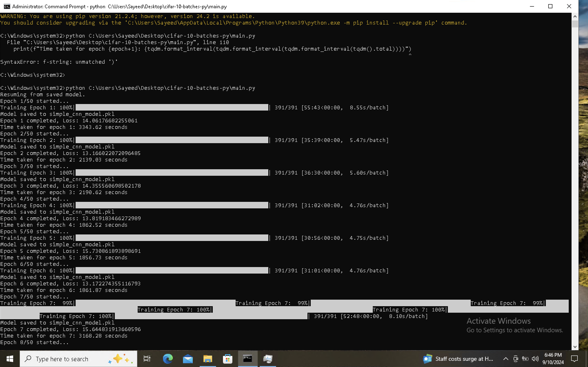

# SimpleCNN - CIFAR-10 Image Classification

after running the training for 7 epochs, the model has achieved an accuracy of **40%**. As we can observe, the accuracy has been gradually increasing with each epoch, indicating that the model is learning and improving. However, training this model is incredibly time-consuming due to the size and complexity of the CIFAR-10 dataset which was actually a 4 Dimensional dataset.

### Model Saving and Epoch-wise Progress
In the provided code, the model is saved after every epoch, ensuring that the training progress is preserved. While it's exciting to see the model improving over time, the **significant amount of time required** to train even one epoch is challenging. Below is a visual representation of the time it takes to complete a single epoch (shown in the attached image), further highlighting the computational intensity of training on a dataset of this scale.

### Decision to Halt Training
Given the substantial time investment required for each epoch and the model’s consistent improvement, I have decided to stop training at this point. While additional training may further improve the accuracy, **40% accuracy** with enough evaluation evidence at this stage is a reasonable stopping point given the resources and time constraints.

Future work could involve optimizing the model or experimenting with different architectures, but for now, the results achieved are significant and demonstrate a strong foundation for the classification task.

## Implementation Details

This project builds a CNN from scratch using NumPy, designed for classifying images from the CIFAR-10 dataset. Below are details on the key functions and their responsibilities.

### 1. `load_cifar10_batch(file_path)`
- **Purpose:** Loads a single batch of CIFAR-10 dataset from the provided file path.
- **Inputs:** File path to a CIFAR-10 batch file.
- **Returns:** Features (reshaped images) and labels from the batch.

### 2. `load_cifar10(data_dir)`
- **Purpose:** Loads the entire CIFAR-10 dataset by iterating through all batch files.
- **Inputs:** Path to the CIFAR-10 data directory.
- **Returns:** Training and testing data (features and labels).

### 3. `SimpleCNN`
- **Purpose:** Defines the CNN model with one convolutional layer and one fully connected layer.
- **Attributes:**
  - `conv1_filters`: Weights for the convolutional layer.
  - `conv1_bias`: Bias for the convolutional layer.
  - `fc1_weights`: Weights for the fully connected layer.
  - `fc1_bias`: Bias for the fully connected layer.
- **Constructor:** Initializes the model with random weights, or loads a saved model if provided.

### 4. `relu(x)`
- **Purpose:** Applies the ReLU activation function to the input.
- **Inputs:** Input matrix `x`.
- **Returns:** Output with ReLU applied (max of 0 and the input).

### 5. `softmax(x)`
- **Purpose:** Computes the softmax for multi-class classification.
- **Inputs:** Input matrix `x`.
- **Returns:** Softmax-normalized probabilities.

### 6. `conv2d(x, filters, bias)`
- **Purpose:** Performs a 2D convolution operation.
- **Inputs:** 
  - `x`: Input feature map.
  - `filters`: Convolution filters.
  - `bias`: Bias for each filter.
- **Returns:** Output of the convolution operation.

### 7. `forward(x)`
- **Purpose:** Implements the forward pass through the network (conv + ReLU + fully connected + softmax).
- **Inputs:** Input data `x`.
- **Returns:** Output probabilities after softmax.

### 8. `save_model(filename)`
- **Purpose:** Saves the model weights and biases to a file.
- **Inputs:** Filename to save the model data.
- **Returns:** None.

### 9. `train(X, y, epochs=10, batch_size=128, learning_rate=0.01, save_path='simple_cnn_model.pkl')`
- **Purpose:** Trains the CNN using batch gradient descent and updates the weights via backpropagation.
- **Inputs:** 
  - `X`: Training data.
  - `y`: Training labels.
  - `epochs`: Number of epochs to train.
  - `batch_size`: Size of each training batch.
  - `learning_rate`: Learning rate for gradient descent.
  - `save_path`: File path to save the model after each epoch.
- **Returns:** None.
- **Process:** 
  - Performs forward pass on each batch.
  - Computes the error and updates the weights using gradient descent.
  - Saves the model at the end of each epoch.
  - Prints loss and time taken for each epoch.

### 10. `__main__` (Main Execution)
- **Purpose:** The entry point of the script.
- **Process:**
  - Loads the CIFAR-10 dataset.
  - Preprocesses the data by normalizing the pixel values.
  - Checks for an existing saved model to resume training.
  - Trains the model for 50 epochs.
  - Evaluates the trained model on the test data and calculates precision and recall.

# How to Test the Saved Model

To evaluate the performance of the saved model on the test dataset, you can use the provided Jupyter notebook `modeltest.ipynb`. This notebook is specifically designed to load the saved model and run it on the CIFAR-10 test data, providing accuracy metrics and other evaluation details.

### Steps to Test:
1. Ensure that the saved model file (e.g., `simple_cnn_model.pkl`) is available in the same directory.
2. Open the `modeltest.ipynb` notebook.
3. Run the cells to load the saved model and evaluate it on the test dataset.

This will give you an overview of the model's performance and accuracy on unseen data.